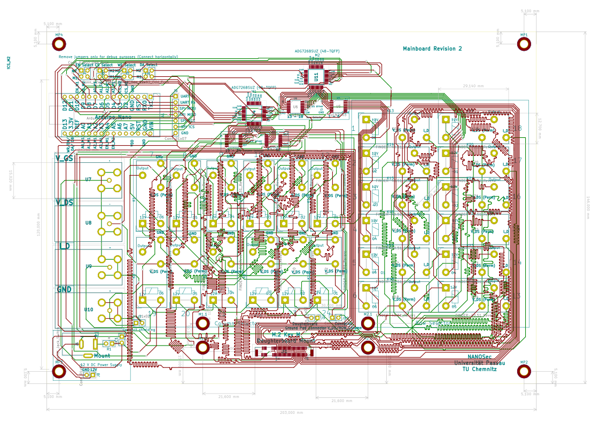

# Measurement Switch Matrix

This repository contains a description of the NanoSEC switch matrix, as well as all the relevant source code, 
to controll the board. 

### 1. Circuit description 

The circuit is subdivided into two parts, a **control part** and a measurement part. 
The measurement part consists of a 12 V power supply forwarded to four darlington arrays, which are responsible
for switching the Finder 40.41 relays. Single lines on the darlington arrays are controlled by two 2/16 ADG726 multiplexers. 
The multiplexer transform a four bit input address signal to a parallel output signal which selects a specific row and column relay
over the Darlington arrays. The multiplexers are controlled by a Arduino Nano.

The measurement part consists of four BNC connectors $V_{ID}$, $V_{DS}$, $V_{GS}$, $V$ and GND. 

#### 1.1 Connections Arduino - ADG726 Multiplexer (M1)

[See documentation of ADG726 Multiplexer](https://www.mouser.de/datasheet/2/609/ADG726_732-1503078.pdf).
[See documentation of Arduino Nano](https://www.mouser.com/pdfdocs/Gravitech_Arduino_Nano3_0.pdf).

| Pin Arduino | Description | ADG726 (U4) | Description   |
|:-----------:|:-----------:|:-----------:|:-------------:|
| Pin 16      |     3.3V    |  Pin 13     | VDD           |
| Pin 16      |     3.3V    |  Pin 14     | VDD           |
| Pin 4/29    |     GND     |  Pin 23     | GND           |
| Pin 4/29    |     GND     |  Pin 24     | VSS           |  
| Pin 5       |     A2      |  Pin 19     | CSA           |
| Pin 5       |     A2      |  Pin 20     | CSB           |
| Pin 12      |     D9      |  Pin 21     | WR            |
| Pin 23      |     A4      |  Pin 22     | EN            |
| Pin 16      |     3.3V    | Pin 43      | DA            |   
| Pin 19      |     A0      | Pin 15      | A0            |
| Pin 20      |     A1      | Pin 16      | A1            |
| Pin 21      |     A2      | Pin 17      | A2            |
| Pin 22      |     A3      | Pin 18      | A3            |

 

##### 1.1.2 Connections Darlington Array (U3) - ADG726 (U4)

| Darlington U3  | Description | Pin ADG726 (U4) | Description  |
|:--------------:|:-----------:|:---------------:|:------------:|
| Pin  1         |     I1      | Pin 1           | S12A         |       
| Pin  2         |     I2      | Pin 2           | S11A         |      
| Pin  3         |     I3      | Pin 3           | S10A         |     
| Pin  4         |     I4      | Pin 4           |  S9A         |
| Pin  5         |     I5      | Pin 5           |  S8A         |     
| Pin  6         |     I6      | Pin 6           |  S7A         |     
 
 

##### 1.1.3 Connections Darlington Array (U3) - ADG726 (U4)

| Darlington U2  | Description | Pin ADG726 (U4) | Description  |
|:--------------:|:-----------:|:---------------:|:------------:|
| Pin  1         |     I1      | Pin 7           |  S8A        |       
| Pin  2         |     I2      | Pin 8           |  S7A         |      
| Pin  3         |     I3      | Pin 9           |  S6A         |     
| Pin  4         |     I4      | Pin 10          |  S5A         |
| Pin  5         |     I5      | Pin 11          |  S4A         |     
| Pin  6         |     I6      | Pin 12          |  S3A         |     

#### 1.2 Connections Arduino - ADG726 Multiplexer (M2)

[See documentation of ADG726 Multiplexer](https://www.mouser.de/datasheet/2/609/ADG726_732-1503078.pdf).
[See documentation of Arduino Nano](https://www.mouser.com/pdfdocs/Gravitech_Arduino_Nano3_0.pdf).

| Pin Arduino | Description | ADG726 (U11) | Description   |
|:-----------:|:-----------:|:-----------:|:-------------:|
| Pin 16      |     3.3V    |  Pin 13     | VDD           |
| Pin 16      |     3.3V    |  Pin 14     | VDD           |
| Pin 4/29    |     GND     |  Pin 23     | GND           |
| Pin 4/29    |     GND     |  Pin 24     | VSS           |  
| Pin 6       |     D3      |  Pin 19     | CSA           |
| Pin 6       |     D3      |  Pin 20     | CSB           |
| Pin 13      |    D10      |  Pin 21     | WR            |
| Pin 24      |     A5      |  Pin 22     | EN            |
| Pin 16      |     3.3V    | Pin 43      | DA            |   
| Pin 8       |     D5      | Pin 15      | A0            |
| Pin 9       |     D6      | Pin 16      | A1            |
| Pin 10      |     D7      | Pin 17      | A2            |
| Pin 11      |     D8      | Pin 18      | A3            |

 

##### 1.1.2 Connections Darlington Array (U3) - ADG726 (U4)

|     Pin U3     | Description | Pin ADG726 (U6) | Description  |
|:--------------:|:-----------:|:---------------:|:------------:|
| Pin  1         |     I1      | Pin 6           | S7A         |       
| Pin  2         |     I2      | Pin 5           | S8A         |      
| Pin  3         |     I3      | Pin 4           | S9A         |     
| Pin  4         |     I4      | Pin 3           |  S10A         |
| Pin  5         |     I5      | Pin 2           |  S11A         |     
| Pin  6         |     I6      | Pin 1           |  S12A         |     
 
 

##### 1.1.3 Connections Darlington Array (U3) - ADG726 (U4)

|     Pin U3     | Description | Pin ADG726 (U5) | Description  |
|:--------------:|:-----------:|:---------------:|:------------:|
| Pin  1         |     I1      | Pin 12           |  S3A        |       
| Pin  2         |     I2      | Pin 11           |  S4A         |      
| Pin  3         |     I3      | Pin 10           |  S5A         |     
| Pin  4         |     I4      | Pin 9            |  S6A         |
| Pin  5         |     I5      | Pin 8            |  S7A         |     
| Pin  6         |     I6      | Pin 7            |  S8A         |     