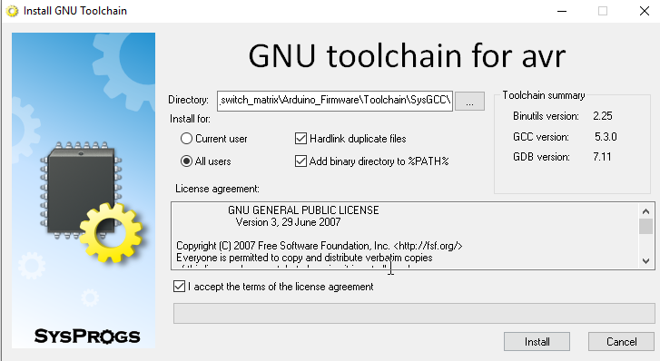

# Measurement Switch Matrix

This repository contains a description of the NanoSEC switch matrix, as well as all the relevant source code, 
to control the board. The material in this repository corresponds to the paper:

[F. Frank et al., "A Dedicated Mixed-Signal Characterisation and Testing Framework for Novel Digital Security Circuits That Use Carbon-Nanotube-Based Physical Unclonable Functions," 2022 11th International Conference on Modern Circuits and Systems Technologies (MOCAST), 2022, pp. 1-4, doi: 10.1109/MOCAST54814.2022.9837567](https://ieeexplore.ieee.org/document/9837567)

**Cite:**
```
@INPROCEEDINGS{9837567,  author={Frank, Florian and Anagnostopoulos, Nikolaos Athanasios and Böttger, 
Simon and Hermann, Sascha and Arul, Tolga and Stavrinides, Stavros G. and Katzenbeisser, Stefan},  
booktitle={2022 11th International Conference on Modern Circuits and Systems Technologies (MOCAST)},   
title={A Dedicated Mixed-Signal Characterisation and Testing Framework for Novel Digital Security 
Circuits That Use Carbon-Nanotube-Based Physical Unclonable Functions},   
year={2022},  
volume={},  
number={},  
pages={1-4},  
doi={10.1109/MOCAST54814.2022.9837567}}
```


### 1. Circuit description 

The circuit is subdivided into two parts, a **control part** and a measurement part. 
The measurement part consists of a 12 V power supply forwarded to four darlington arrays (ULN2003APW), which are responsible
for switching the Finder 40.41 relays. Single lines on the darlington arrays are controlled by two 2/16 ADG726 multiplexers. 
The multiplexer transform a four bit input address signal to a parallel output signal which selects a specific row and column relay
over the Darlington arrays. The multiplexers are controlled by a Arduino Nano.

The measurement part consists of four BNC connectors I_D, V_DS, V_GS and GND.
V_DS connects is forwarded to each CNT_FETs on the matrix not switched. 
I_D is forwarded to the selected row.
GND is forwarded to the selected column.
V_GS is connected to the global gate.


#### 1.1 Overview Components

This table contains an overview of the components on the Motherboard. 
Each component is identified by a Symbol ID.

| Symbol | Component         | Description                                            |
|:------:|:-----------------:|:------------------------------------------------------:|
| U1     | [5-1634556-0-1 ](https://www.mouser.de/datasheet/2/418/7/ENG_CD_1634556_G2-2014703.pdf). | PCI-E M.2 Key M connector to mount the daugher boards  |
| U2     | [ALN2003APW](https://www.ti.com/general/docs/suppproductinfo.tsp?distId=26&gotoUrl=http%3A%2F%2Fwww.ti.com%2Flit%2Fgpn%2Fuln2003a). | Darlington arrays consists of two transistors to forward 12V to the relays controlled by a 3V control signal (Responsible for relay 19 - 23 column). |
| U3     | [ALN2003APW](https://www.ti.com/general/docs/suppproductinfo.tsp?distId=26&gotoUrl=http%3A%2F%2Fwww.ti.com%2Flit%2Fgpn%2Fuln2003a). | Darlington arrays consists of two transistors to forward 12V to the relays controlled by a 3V control signal (Responsible for relay 7 - 12 column). |
| U4     | [ADG726 Multiplexer](https://www.mouser.de/datasheet/2/609/ADG726_732-1503078.pdf). | 2x16 Multiplexer to forward parallel lines to the Darlington Arrays controlled by a 4-bit column address. |
| U5     | [ALN2003APW](https://www.ti.com/general/docs/suppproductinfo.tsp?distId=26&gotoUrl=http%3A%2F%2Fwww.ti.com%2Flit%2Fgpn%2Fuln2003a). | Darlington arrays consists of two transistors to forward 12V to the relays controlled by a 3V control signal (Responsible for relay 1 - 6 row). |
| U6     | [ALN2003APW](https://www.ti.com/general/docs/suppproductinfo.tsp?distId=26&gotoUrl=http%3A%2F%2Fwww.ti.com%2Flit%2Fgpn%2Fuln2003a). | Darlington arrays consists of two transistors to forward 12V to the relays controlled by a 3V control signal (Responsible for relay 13 - 18 row). |
| U7     | [5-1634556-0-1 ](https://www.mouser.de/datasheet/2/418/7/ENG_CD_1634556_G2-2014703.pdf). | Angled BNC connector to connect the V_GS signal. |
| U8     | [5-1634556-0-1 ](https://www.mouser.de/datasheet/2/418/7/ENG_CD_1634556_G2-2014703.pdf).     | Angled BNC connector to connect the V_DS signal. |
| U9     | [5-1634556-0-1 ](https://www.mouser.de/datasheet/2/418/7/ENG_CD_1634556_G2-2014703.pdf).     | Angled BNC connector to connect the I_D signal. |
| U10    | [5-1634556-0-1 ](https://www.mouser.de/datasheet/2/418/7/ENG_CD_1634556_G2-2014703.pdf).     | Angled BNC connector to connect the GND signal. |
| U11    | [ADG726 Multiplexer](https://www.mouser.de/datasheet/2/609/ADG726_732-1503078.pdf).        | 2x16 Multiplexer to forward parallel lines to the Darlington Arrays controlled by a 4-bit row address. |
| K1-K12 | [Finder 0.51.9.012.0000 ](https://asset.re-in.de/add/160267/c1/-/en/001419701DS02/DA_Finder-40.51.9.012.0000-Printrelais-12-V-DC-10A-1-Wechsler-1St..pdf)  | Single Pole Double Throw Relay to select a column on the daugherboard and forward GND to the CNT FET if not switched V_DS is forwarded | 
| K13-K24 | [Finder 0.51.9.012.0000 ](https://asset.re-in.de/add/160267/c1/-/en/001419701DS02/DA_Finder-40.51.9.012.0000-Printrelais-12-V-DC-10A-1-Wechsler-1St..pdf). | Single Pole Double Throw Relay to select a row on the daugherboard and forward I_D to the CNT FET if not switched V_DS is forwarded |
| R1 | Diode xx  |  |
| C1 | Capacitor xx  | Stabilizes possible variations caused by the DC power supply |
| A1 | [Arduino Nano Connector](https://www.mouser.com/pdfdocs/Gravitech_Arduino_Nano3_0.pdf). | Pin Socket connector Pitch 2.54 to connect an Arduino Nano to the board |
| J1 | DA selector | Debugging Pin to connect the Data output (here data output serves as input and is forwarded to the parallel lines) connectors of U4 (Lower Row) and CS signal of U11 (Upper Row) with the 3.3V pin of the Arduino. The rows must be connected horizontally by a 2.54mm Jumper |
| J2 | CS selector | Debugging Pin to connect the CS signal of U4 (Lower Row) and CS signal of U11 (Upper Row) with D3 and D2 pin of the Arduino. The rows must be connected horizontally by a 2.54mm Jumper |
| J3 | WE selector | Debugging Pin to connect the WE signal of U4 (Lower Row) and CS signal of U11 (Upper Row) with D9 and D10 pin of the Arduino. The rows must be connected horizontally by a 2.54mm Jumper |
| J4 | EN selector | Debugging Pin to connect the EN signal of U4 (Lower Row) and EN signal of U11 (Upper Row) with A4 and A5 pin of the Arduino. The rows must be connected horizontally by a 2.54mm Jumper |
| J5 | Arduino additional pin header  | Additional pin header to access UART TX and RX pins as well as GND and the SPI interface of the Arduino Nano |
| J6 | [BarrelJack Wuerth 6941xx301002 ](http://katalog.we-online.de/em/datasheet/6941xx301002.pdf).  | Wuerth electronics barrel jack connector (5.5mm outher diameter, inner diameter 2.55mm) used to connect a 12V power supply used to switch the relays |
| J7 | Shielding connector  | Pin header to connect the GND BNC connector U10 with the shielding of all other BNC connectors by using a 2.54mm Jumper. |
| J9 | Ground Pad connector  | Pin header to connect the daughter board ground connector with the GND BNC connector U10. |
| J10 | V_DS connector  | Connector to forward V_DS to the row and column relays. Must be connected by a 2.54mm jumper. |
| MP* | Mounting holes  | To mount the board using M2 or M3 screws to a holder or case. The four mounting holes in the vicinity of the M.2 interface are used to mount holders for the daugherboard. The hole are placed according to the PC/104 EBX standard. | 

#### 1.2 Connections 

The following tables contain the connections between the components described in 1.1.

#### 1.2.1 Connections Arduino - ADG726 Multiplexer (M1)


| Pin Arduino | Description | ADG726 (U4) | Description   |
|:-----------:|:-----------:|:-----------:|:-------------:|
| Pin 16      |     3.3V    |  Pin 13     | VDD           |
| Pin 16      |     3.3V    |  Pin 14     | VDD           |
| Pin 4/29    |     GND     |  Pin 23     | GND           |
| Pin 4/29    |     GND     |  Pin 24     | VSS           |  
| Pin 5       |     A2      |  Pin 19     | CSA           |
| Pin 5       |     A2      |  Pin 20     | CSB           |
| Pin 12      |     D9      |  Pin 21     | WR            |
| Pin 23      |     A4      |  Pin 22     | EN            |
| Pin 16      |     3.3V    | Pin 43      | DA            |   
| Pin 19      |     A0      | Pin 15      | A0            |
| Pin 20      |     A1      | Pin 16      | A1            |
| Pin 21      |     A2      | Pin 17      | A2            |
| Pin 22      |     A3      | Pin 18      | A3            |

<BR>

##### 1.2.2 Connections Darlington Array (U3) - ADG726 (U4)

| Darlington U3  | Description | Pin ADG726 (U4) | Description  |
|:--------------:|:-----------:|:---------------:|:------------:|
| Pin  1         |     I1      | Pin 1           | S12A         |       
| Pin  2         |     I2      | Pin 2           | S11A         |      
| Pin  3         |     I3      | Pin 3           | S10A         |     
| Pin  4         |     I4      | Pin 4           |  S9A         |
| Pin  5         |     I5      | Pin 5           |  S8A         |     
| Pin  6         |     I6      | Pin 6           |  S7A         |     
| Pin  8         |     GND      | Pin 4/29       |  GND         |    

<BR>

##### 1.2.3 Connections Darlington Array (U3) - ADG726 (U4)

| Darlington U2  | Description | Pin ADG726 (U4) | Description  |
|:--------------:|:-----------:|:---------------:|:------------:|
| Pin  1         |     I1      | Pin 7           |  S8A        |       
| Pin  2         |     I2      | Pin 8           |  S7A         |      
| Pin  3         |     I3      | Pin 9           |  S6A         |     
| Pin  4         |     I4      | Pin 10          |  S5A         |
| Pin  5         |     I5      | Pin 11          |  S4A         |     
| Pin  6         |     I6      | Pin 12          |  S3A         |     
| Pin  8         |     GND      | Pin 4/29       |  GND         |    

<BR>


##### 1.2.4 Connections Arduino - ADG726 Multiplexer (M2)


| Pin Arduino | Description | ADG726 (U11) | Description   |
|:-----------:|:-----------:|:-----------:|:-------------:|
| Pin 16      |     3.3V    |  Pin 13     | VDD           |
| Pin 16      |     3.3V    |  Pin 14     | VDD           |
| Pin 4/29    |     GND     |  Pin 23     | GND           |
| Pin 4/29    |     GND     |  Pin 24     | VSS           |  
| Pin 6       |     D3      |  Pin 19     | CSA           |
| Pin 6       |     D3      |  Pin 20     | CSB           |
| Pin 13      |    D10      |  Pin 21     | WR            |
| Pin 24      |     A5      |  Pin 22     | EN            |
| Pin 16      |     3.3V    | Pin 43      | DA            |   
| Pin 8       |     D5      | Pin 15      | A0            |
| Pin 9       |     D6      | Pin 16      | A1            |
| Pin 10      |     D7      | Pin 17      | A2            |
| Pin 11      |     D8      | Pin 18      | A3            |


<BR>

##### 1.2.5 Connections Darlington Array (U3) - ADG726 (U4)

|     Pin U6     | Description | Pin ADG726 (U11) | Description  |
|:--------------:|:-----------:|:---------------:|:------------:|
| Pin  1         |     I1      | Pin 6           | S7A         |       
| Pin  2         |     I2      | Pin 5           | S8A         |      
| Pin  3         |     I3      | Pin 4           | S9A         |     
| Pin  4         |     I4      | Pin 3           |  S10A         |
| Pin  5         |     I5      | Pin 2           |  S11A         |     
| Pin  6         |     I6      | Pin 1           |  S12A         |     
| Pin  8         |     GND      | Pin 4/29       |  GND         |    
<BR>

##### 1.2.6 Connections Darlington Array (U3) - ADG726 (U4)

|     Pin U5     | Description | Pin ADG726 (U11) | Description  |
|:--------------:|:-----------:|:---------------:|:------------:|
| Pin  1         |     I1      | Pin 12           |  S3A        |       
| Pin  2         |     I2      | Pin 11           |  S4A         |      
| Pin  3         |     I3      | Pin 10           |  S5A         |     
| Pin  4         |     I4      | Pin 9            |  S6A         |
| Pin  5         |     I5      | Pin 8            |  S7A         |     
| Pin  6         |     I6      | Pin 7            |  S8A         |

<BR>

##### 1.2.7 Connections Darlington Array COM -GND (U2, U3, U5, U6)

|     Pin U2, U3, U5, U6     | Description | Component (Pin) | Description  |
|:--------------:|:-----------:|:---------------:|:------------:|
| Pin  8         |     GND      | Arduino Pin (Pin 4/29), J6 (GND)    |  GND         |    
| Pin  9         |     COM      | J6 (VDD)       |  12 V Power Supply         |    


<BR>

##### 1.2.8 Connections M.2 interface (J1)


|     Pin J1     | Description | Component            | Description  |
|:--------------:|:-----------:|:--------------------:|:------------:|
| Pin  1         |  GND Pad    | J9 |  Connected with ground pad connector forwarded to BNC GND (U10)        |       
| Pin  3         |     Row 1      | K13 | Connected to Relay output (Pin 11). Line length: 318 mm|     
| Pin  5         |     Row 2      | K14 | Connected to Relay output (Pin 11). Line length: 318 mm |    
| Pin  7         |     Row 3      | K15 | Connected to Relay output (Pin 11). Line length: 318 mm |
| Pin  9         |     Row 4      | K16 | Connected to Relay output (Pin 11). Line length: 318 mm |
| Pin  11         |     Row 5     | K17 | Connected to Relay output (Pin 11). Line length: 318 mm |
| Pin  13         |     Row 6     | K18 | Connected to Relay output (Pin 11). Line length: 318 mm |
| Pin  15         |     Column 1  | K1 | Connected to Relay output (Pin 11). Line length: 318 mm |
| Pin  17         |     Column 2  | K3 | Connected to Relay output (Pin 11). Line length: 318 mm |
| Pin  19         |     Column 3  | K5 | Connected to Relay output (Pin 11). Line length: 318 mm |
| Pin  21         |     Column 4  | K7 | Connected to Relay output (Pin 11). Line length: 318 mm |
| Pin  23         |     Column 5  | K9 | Connected to Relay output (Pin 11). Line length: 318 mm |
| Pin  25         |     Column 6  | K11 | Connected to Relay output (Pin 11). Line length: 318 mm |
| Pin  27         |     Row 7      | K19 | Connected to Relay output (Pin 11). Line length: 318 mm |
| Pin  29         |     Row 8      | K20 | Connected to Relay output (Pin 11). Line length: 318 mm |     
| Pin  31         |     Row 9      | K21 | Connected to Relay output (Pin 11). Line length: 318 mm |
| Pin  33         |     Row 10      | K22 | Connected to Relay output (Pin 11). Line length: 318 mm |     
| Pin  35         |     Row 11     | K23 | Connected to Relay output (Pin 11). Line length: 318 mm |
| Pin  37         |     Row 12     | K24 | Connected to Relay output (Pin 11). Line length: 318 mm |
| Pin  39         |     Column 7      | K2 | Connected to Relay output (Pin 11). Line length: 318 mm |
| Pin  41         |     Column 8      | K4 | Connected to Relay output (Pin 11). Line length: 318 mm |      
| Pin  43         |     Column 9      | K6 | Connected to Relay output (Pin 11). Line length: 318 mm |     
| Pin  45         |     Column 10     | K8 | Connected to Relay output (Pin 11). Line length: 318 mm |
| Pin  47         |     Column 11      | K10 | Connected to Relay output (Pin 11). Line length: 318 mm |     
| Pin  49         |     Column 12  | K12 | Connected to Relay output (Pin 11). Line length: 318 mm |
| Pin  53         |     V_GS  | U7 | Connected to the V_GS BNC connector. Line length: 180 mm |

<BR>

##### 1.2.9 Connections V_DS (U8)

|     Pin U7     | Description | Component            | Description  |
|:--------------:|:-----------:|:--------------------:|:------------:|
| V_GS           | Gate Source connector | J1 (Pin 53) | Connects to the common ground via the M.2 connector Pin 53 |

<BR>

##### 1.2.10 Connections V_DS (U8)

|     Pin U8     | Description | Component            | Description  |
|:--------------:|:-----------:|:--------------------:|:------------:|
| V_DS           | Drain Source connector | K 1 - K24 | Connected to the permanently connected input Pin 12 |

<BR>


##### 1.2.11 Connections I_D (U9)

Routed on the Backside. Common length of 316 mm.

|     Pin U9     | Description | Component            | Description  |
|:--------------:|:-----------:|:--------------------:|:------------:|
| I_D           | - | K 13 - K24 | Forwarded to a specific row when a row relay is switched.  |

<BR>


##### 1.2.12 Connections GND (U9)

Routed on the Backside. Common length of 140 mm.

|     Pin U9     | Description | Component            | Description  |
|:--------------:|:-----------:|:--------------------:|:------------:|
| GND           | - | K 1 - K12 | Forwarded to a specific column when a column relay is switched.  |

##### 1.2.13 Connections Arduino Breakout Pin Headers (J5)

|     Pin A1     | Description | Pin J5            | Description  |
|:--------------:|:-----------:|:--------------------:|:------------:|
| Pin 1           | Tx0 | Pin 1 | UART TX (Transmission) Pin.  |
| Pin 2           | Rx0 | Pin 2 | UART Rx (Receive) Pin.  |
| Pin 14           | SPI MOSI | Pin 3 | SPI Master out Slave in signal.  |
| Pin 15           | SPI MISO | Pin 4 | SPI Slave in Master out signal.  |
| Pin 16           | SPI SCK | Pin 5 | SPI clock signal.  |
| Pin 7           | SPI CS | Pin 6 | SPI chip select signal.  |
| Pin 4/29           | GND | Pin 7 | Ground connection.  |

<BR>

### 2. Connecting the board

#### 2.1 Connect the Arduino Nano 

Connect the Arduino Nano to the NanoSEC Switch Matrix like shown in the following picture.
Use a Micro USB cable to connect the arduino to the computer. The Arduino is working if the green 
'ON' led is green. If the Arduino was flashed once the firmware is automatically restarted on the device
when it's connected to the power supply of the computer. The Arduino should show up in the device manager. 
On linux the device should be registered as '/dev/ttyUSB0'.


#### 2.2 Connect the Power Supply

A DC power supply must be connected to drive the relays. The power supply can be connected by the barrel jack connector
on the left buttom of the board or by connecting jumper cables to the power supply pins below the barrel jack connector.


Please check the maximum ratings like described in the following table.

|   Unit       | Minimum | Maximum  |
|:------------:|:--------|:--------:|
| Voltage      |   12    |       12 |
| Current      | 83mA    |    500mA |

When two relays are switched a current of 83mA can be observed on a DC power supply like shown in the subsequent figure.


#### 2.3 Jumpers 

The board contains several Jumpers for debugging purposes or to execute differnt types of measurements. 
  
  TODO add jumper descriptions.


### 3. Setup and Production

The code is basically subdivided into two different components. 
- The **Arduino Firmware** which is the code executed on the Arduino Nano. 
It accepts commands via an UART interface and forwards the commands to the multiplexers, which switch the corresponding rows and columns.
  <br><br>
- The **Client Side API** is executed on the computer responsible for the test execution and communicates the 
commands to the Arduino Nano via an UART interface.
  
#### 3.1 Preconditions
  
##### 3.1.1 Install git
  
 On Windows: 
  ```
  Follow the link:
  https://git-scm.com/download/win
  And install the executable.
  ```
 On Linux:
  ```
  # apt-get install git
  ```
  
#### 3.1.2 Clone the directory
  
  ```
$ git clone https://github.com/FlorianFrank/measurement_switch_matrix.git
Cloning into 'measurement_switch_matrix'...
Username for 'https://github.com': test
Password for 'https://test@github.com': test123
  ```
##### 3.1.3 Update on changes
  
 ```
  $ git pull
 ```
  
  Updates the current working copy to the current version on the repo.

##### 3.1.1 Install the avr-gcc compiler

First hte avr-gcc compiler must be installed. Therefore, go to **Arduino_Firmware/Toolchain/SysGCC** and execute **avr-gcc5.3.0.exe
.** You see an installation dialog. Like shown the in the figure below. Select the Arduino_firmware/Toolchain/ directory and install the compiler.



##### 3.1.2 Further tools

Further tools like cmake and ninja are already included in the repository in the Toolchain folder and do not have to be installed
manually. 

##### 3.1.3 Compiling AVRDude

We are using AVRDude to flash the firmware image on the Arduino Nano. 
You can find the installation under Toolchain/AVRDude. 

On Windows: 
<br>
There is alredy a precompiled version under AVRDude/bin/Win32 so the files don't need to be compiled

On Linux: 
<br>
Go to AVRDude and run: 
```
./compile_linux.sh
```

Afterwareds you will find the avr compilation under bin/amd64.

#### 3.2 Look up the COM Port

Press the windows button on the keyboard and go to the device manager. The device should be listed as **"USB Serial Port (COM[ID])".**
In a next step adjust the settings.cmake.


##### 3.3 Setting CMAKE settings

In the Arduino_Firmware folder you can find a settings.cmake file.  
These contain the most important properties of the firmware. 
To build and flash the Arduino firmware. Only the USB_Port must be adjusted. You can check out the correct
'COM' port in the device manager.

```
option(BUILD_DOCUMENTATION "BUILD_DOCUMENTATION" OFF)
option(ARDUINO_NANO_OLD "BUILD for old Arduino Nano Board (blue)" ON)
option(USB_PORT "Set the USB port on Linux /dev/ttyUSB0 on windows COM<comID>" "COM6")
option(ARDUINO_PROGRAMMER "Set the programmer to be used to flash the Arduino Nano" "avrispmkii")

```
When using the old version of the Arduino Nano (blue PCB) the flag ARDUINO_NANO_OLD must be set to ON.


```
option(ARDUINO_NANO_OLD "BUILD for old Arduino Nano Board (blue)" OFF)
# uses the atmega328 programmer
```


```
option(ARDUINO_NANO_OLD "BUILD for old Arduino Nano Board (blue)" ON)
# uses the atmega328old programmer
```


When using the old version of the Arduino Nano (blue PCB) the flag ARDUINO_NANO_OLD must be set to ON.
To compile the firmware for the new version (green PCB) this flag must be disabled. 
Set the BUILD_DOCUMENTATION option to automatically build the Code Documentation as HTML and Latex files. 


##### 3.4 Compiling the firmware

On Linux run: 

```
cd ./Arduino_Firmware
./compile.sh
```

On Windows run:

```
cd ./Arduino_Firmware
./compile.bat
```
<br><br>
After comiling you find a folder ./build in the Arduino Firmware directory containing the firmware to be flashed on the Arduino Nano.
The firmware is build sucessfully when you see an output similar to the command line output below:
```
[100%] Linking CXX executable nanosec_crossbar_controller.elf
Generating EEP image
Generating HEX image
Calculating image size
Firmware Size:  [Program: 8186 bytes (25.0%)]  [Data: 641 bytes (31.3%)] on atmega328p
EEPROM   Size:  [Program: 0 bytes (0.0%)]  [Data: 0 bytes (0.0%)] on atmega328p

[100%] Built target nanosec_crossbar_controller
```


##### 3.5 Flashing the Firmware onto the Arduino Nano

On Linux run after compiling:

```
cd ./Arduino_Firmware
./flash.sh
```


On Windows after compiling:

```
cd ./Arduino_Firmware
./flash.bat
```

fterwards you should see following output:

```
avrdude: Version 6.4
         Copyright (c) Brian Dean, http://www.bdmicro.com/
         Copyright (c) Joerg Wunsch

         System wide configuration file is "/home/florianfrank/Documents/Research/Projects/NanoSec/measurement_switch_matrix/Arduino_Firmware/Toolchain/AVRDude/config/avrdude.conf"
         User configuration file is "/home/florianfrank/.avrduderc"
         User configuration file does not exist or is not a regular file, skipping

         Using Port                    : /dev/ttyUSB0
         Using Programmer              : arduino
         Overriding Baud Rate          : 115200
         AVR Part                      : ATmega328P
         Chip Erase delay              : 9000 us
         PAGEL                         : PD7
         BS2                           : PC2
         RESET disposition             : dedicated
         RETRY pulse                   : SCK
         serial program mode           : yes
         parallel program mode         : yes
         Timeout                       : 200
         StabDelay                     : 100
         CmdexeDelay                   : 25
         SyncLoops                     : 32
         ByteDelay                     : 0
         PollIndex                     : 3
         PollValue                     : 0x53
         Memory Detail                 :

                                  Block Poll               Page                       Polled
           Memory Type Mode Delay Size  Indx Paged  Size   Size #Pages MinW  MaxW   ReadBack
           ----------- ---- ----- ----- ---- ------ ------ ---- ------ ----- ----- ---------
           eeprom        65    20     4    0 no       1024    4      0  3600  3600 0xff 0xff
           flash         65     6   128    0 yes     32768  128    256  4500  4500 0xff 0xff
           lfuse          0     0     0    0 no          1    1      0  4500  4500 0x00 0x00
           hfuse          0     0     0    0 no          1    1      0  4500  4500 0x00 0x00
           efuse          0     0     0    0 no          1    1      0  4500  4500 0x00 0x00
           lock           0     0     0    0 no          1    1      0  4500  4500 0x00 0x00
           calibration    0     0     0    0 no          1    1      0     0     0 0x00 0x00
           signature      0     0     0    0 no          3    1      0     0     0 0x00 0x00

         Programmer Type : Arduino
         Description     : Arduino
         Hardware Version: 3
         Firmware Version: 4.4
         Vtarget         : 0.3 V
         Varef           : 0.3 V
         Oscillator      : 28.800 kHz
         SCK period      : 3.3 us

avrdude: AVR device initialized and ready to accept instructions

Reading | ################################################## | 100% 0.01s

avrdude: Device signature = 0x1e950f (probably m328p)
avrdude: safemode: lfuse reads as 0
avrdude: safemode: hfuse reads as 0
avrdude: safemode: efuse reads as 0
avrdude: reading input file "/home/florianfrank/Documents/Research/Projects/NanoSec/measurement_switch_matrix/Arduino_Firmware/build/nanosec_crossbar_controller.hex"
avrdude: writing flash (8186 bytes):

Writing | ################################################## | 100% 3.07s

avrdude: 8186 bytes of flash written
avrdude: verifying flash memory against /home/florianfrank/Documents/Research/Projects/NanoSec/measurement_switch_matrix/Arduino_Firmware/build/nanosec_crossbar_controller.hex:
avrdude: load data flash data from input file /home/florianfrank/Documents/Research/Projects/NanoSec/measurement_switch_matrix/Arduino_Firmware/build/nanosec_crossbar_controller.hex:
avrdude: input file /home/florianfrank/Documents/Research/Projects/NanoSec/measurement_switch_matrix/Arduino_Firmware/build/nanosec_crossbar_controller.hex contains 8186 bytes
avrdude: reading on-chip flash data:

Reading | ################################################## | 100% 2.75s

avrdude: verifying ...
avrdude: 8186 bytes of flash verified
avrdude: reading input file "/home/florianfrank/Documents/Research/Projects/NanoSec/measurement_switch_matrix/Arduino_Firmware/build/nanosec_crossbar_controller.eep"
avrdude: writing eeprom (0 bytes):

Writing | ################################################## | 100% 0.00s

avrdude: 0 bytes of eeprom written
avrdude: verifying eeprom memory against /home/florianfrank/Documents/Research/Projects/NanoSec/measurement_switch_matrix/Arduino_Firmware/build/nanosec_crossbar_controller.eep:
avrdude: load data eeprom data from input file /home/florianfrank/Documents/Research/Projects/NanoSec/measurement_switch_matrix/Arduino_Firmware/build/nanosec_crossbar_controller.eep:
avrdude: input file /home/florianfrank/Documents/Research/Projects/NanoSec/measurement_switch_matrix/Arduino_Firmware/build/nanosec_crossbar_controller.eep contains 0 bytes
avrdude: reading on-chip eeprom data:

Reading | ################################################## | 100% 0.00s

avrdude: verifying ...
avrdude: 0 bytes of eeprom verified

avrdude: safemode: lfuse reads as 0
avrdude: safemode: hfuse reads as 0
avrdude: safemode: efuse reads as 0
avrdude: safemode: Fuses OK (E:00, H:00, L:00)

avrdude done.  Thank you.

```

### 3. Communication Protocol

A lightweight communication protocol is implemented on the Arduino Nano tunneled over the USB UART interface.
A UART connection is established by simply plugin in the Mini USB cable. On linux for example, the device is 
typically available under "/dev/ttyUSB0" on Windows the device can be seen in the device manager under "COMxx".

#### 3.1 UART properties 

|     Properties     | Values |
|:--------------:|:-----------:|
| Baudrate            | 115200  |
| Data bits           | 8  |
| Stop Bits           | 8  |
| Parity              | None  |
| Flow control        | None  |

##### 3.2 Commands

|     Command     | Description | Allowed values |
|:--------------:|:-----------:|:-----------:|
| connect            | Connect to the Arduino controller  | - |
| disconnect            | Disconnect the connection  | - |
| r:           | Select a row | 1- 12  |
| c:           | Select a column | 1- 12  |
| ack           | Command was acknowledged by the Arduino controller | -  |
| error:           | Error code returned by the Arduino controller |  Any error message |

Sample accessing the protocol on linux: 
```shell
$ serial /dev/ttyUSB0
$ connect
-> ack
$ r: 1
 ack
$ c: 1
 ack

$ column: 15
 error: Invalid index

$ disconnect
 ack
```

### 4 Python Tester

In the folder python_tester you can find a python test application, which switches all relays 
in an infinite loop. 

##### 4.1 Installation

- On Windows: 
  - Install Python3 (e.g. 3.10.2) from the [official home page](https://www.python.org/downloads/).
  - Install pyserial from the [official home page](https://pypi.org/project/pyserial/#files)

- On Linux
  ```shell
  # Install python3
  $ sudo apt-get install python3
  $ sudo apt-get install pip3
  $ sudo pip install pyserial
  ```

##### 4.2 Execution

  To run the program execute following command.
  Thereby <serial_port> must be replaced with the actual port to which the Arduino is connected. 
  On Linux this is typically /dev/ttyUSB0 on Windows computers you can look up the port in the device manager. 


  ```shell
  $ python3 switch_matrix_tester.py "<serial_port>"
  ```

